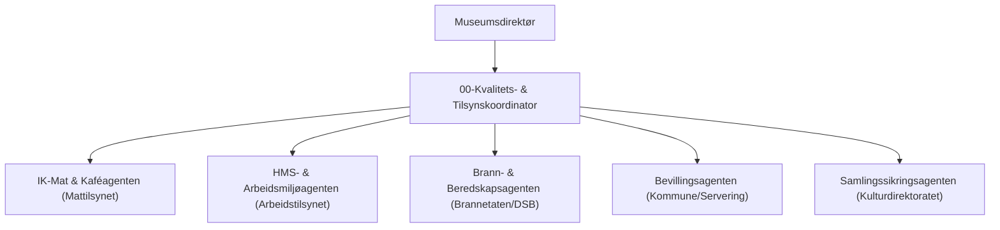

# Kvalitets- og styringssystem (Internkontroll) for Kunstpixel
## Myndighetskrav, HMS, Sikkerhet og IK-Mat for Museumskaféen

---

### 1. Formål og lovhjemler

Dette styringssystemet sikrer at Kunstpixel (kunstpixel.com) oppfyller alle lovpålagte krav overfor norske tilsynsmyndigheter i henhold til:
* **Internkontrollforskriften** (Forskrift om systematisk helse-, miljø- og sikkerhetsarbeid i virksomheter)
* **Arbeidsmiljøloven** (AML)
* **Matloven og Næringsmiddelhygieneforskriften** (Mattilsynet)
* **Matinformasjonsforskriften** (Allergenmerking)
* **Brann- og eksplosjonsvernloven** med forskrift om brannforebygging (DSB / Brann- og redningsetaten)
* **Serveringsloven og Alkoholloven** (Kommunal næringsetat / bevillingsmyndighet)

---

### 2. Myndighetsagenter for Kunstpixel

For å drifte og revidere systemet etableres fem spesialiserte compliance-agenter:

1. **`00-Kvalitets- & Tilsynskoordinator`**: Samler avvikslogger, kaller inn til årlig HMS-gjennomgang og sikrer at dokumentasjon er oppdatert for tilsyn.
2. **`IK-Mat & Kaféagenten`**: Ansvarlig for fareanalyse (HACCP), temperaturlogger, renholdsplaner og allergenkontroll for museumskaféen.
3. **`HMS- & Arbeidsmiljøagenten`**: Gjennomfører vernerunder, kartlegger ergonomi og psykososialt arbeidsmiljø for museumsverter og montører.
4. **`Brann- & Beredskapsagenten`**: Kontrollerer rømingsveier, slukkeutstyr, maksimalt persontall og beredskapsplaner.
5. **`Bevillings- & Forvaltningsagenten`**: Påser at serveringsbevilling og eventuell skjenkebevilling overholdes i tråd med kommunale retningslinjer.

---

### 3. Del A: IK-Mat for Museumskaféen (Mattilsynet)

Museumskaféen serverer kaffe, hjemmebakst, enkle lunsjretter og forfriskninger til museets gjester.

#### 3.1 Fareanalyse og kritiske styringspunkter (HACCP)
| Fare / Risiko | Kritiske grenser | Overvåking | Korrigerende tiltak |
| :--- | :--- | :--- | :--- |
| **Kjølekjedebrudd** | Kjøleskap: maks $+4^\circ\text{C}$ Fryser: maks $-18^\circ\text{C}$ | Digital avlesning 2 ganger daglig i logg | Kaste matvarer som har stått $> +8^\circ\text{C}$ over 2 timer. Tilkalle servicetekniker. |
| **Varmebehandling / Varmholding** | Kjernetemperatur ved oppvarming: min $+72^\circ\text{C}$ Varmholding: min $+60^\circ\text{C}$ | Stikkprøvekontroll med innstikkstermometer | Kaste varer som faller under $+60^\circ\text{C}$ i varmmatbuffet. |
| **Allergenforurensning** | Null krysskontaminering mellom glutenfritt/nøttefritt og konvensjonelle bakverk | Fysisk separerte skjærebrett, klyper og beholdere | Merke varen som kontaminert og fjerne fra allergenfri sone. |
| **Vann og personlig hygiene** | Krav til håndvask, rene uniformer og fravær av smittsomme sykdommer | Daglig sjekkliste før vaktstart | Ansatte med magesyke har 48 timers karantene etter symptomfrihet. |

#### 3.2 Lovpålagt allergenmerking (Matinformasjonsforskriften)
Alle 14 lovpålagte allergener (gluten, melk, egg, nøtter, peanøtter, soya, fisk, skalldyr, bløtdyr, selleri, sennep, sesam, lupin, sulfitt) skal være **skriftlig tilgjengelig for gjesten** uten at gjesten må spørre betjeningen:
* Tydelige skilt ved hver kake/rett i disken med ikon/tekst for allergener.
* Komplett allergenmatrise i kaféens kassepunkt og tilgjengelig via QR-kode/nettside.

#### 3.3 Renholds- og skadedyrplan
* **Daglig renhold:** Desinfisering av kontaktflater, kaffemaskin, oppvaskmaskin (sluttskyll min $85^\circ\text{C}$).
* **Ukentlig renhold:** Grundig vask av kjølerom, bak utstyr og gulvsluk.
* **Skadedyr:** Årlig avtale med autorisert skadedyrfirma med faste inspeksjoner og loggføring.

---

### 4. Del B: Helse, miljø og sikkerhet (Arbeidstilsynet)

#### 4.1 Fysisk arbeidsmiljø
* **Ergonomi for museumsverter:** Roterende vakter mellom stasjonær tilstedeværelse i salene og kafé/skrankearbeid for å motvirke belastningsskader fra harde steingulv.
* **Tunge løft og montering:** All forflytning av skulpturer eller malerier over 25 kg krever minimum to personer og godkjent løfteutstyr (sugekopper, jekketraller).
* **Verneutstyr (PPE):** Hansker for kunsthåndtering (hvite bomullshansker eller nitril) og vernesko ved monteringsarbeid.

#### 4.2 Psykososialt arbeidsmiljø og publikumskonflikter
* **Konflikthåndtering:** Retningslinjer for opptreden ved berusede, aggressive eller utagerende gjester.
* **Alenearbeid:** Forbud mot alenearbeid ved åpningsarrangementer med forventet over 100 gjester.
* **Varslingsrutiner:** Etablert trygg kanal for varsling om kritikkverdige forhold etter arbeidsmiljøloven § 2 A.

---

### 5. Del C: Brannvern og rømming (DSB / Brann- og redningsetaten)

#### 5.1 Kapasitet og personantall
* **Maksimalt personbelegg:**
  * Sal A: 50 personer
  * Sal B: 40 personer
  * Sal C: 35 personer
  * Sal D: 35 personer
  * Sal E (Temporær): 60 personer
  * Museumskafé: 45 sitteplasser
  * **Totalt maksimalt samtidig belegg for bygget:** 250 personer.
* **Rømningsveier:**
  * Alle rømningsveier skal være fri for gjenstander, kabler eller utstillingspodier til enhver tid.
  * Nødlys og panikkskilt kontrolleres månedlig.
* **Kunstevakuering (Restverdiredning - RVR):**
  * Prioritetsliste 1 (Rødt merke bak rammen): Uerstattelige hovedverk (f.eks. *Skrik* i Sal D) evakueres først dersom det er trygt for mannskapet.

---

### 6. Del D: Servering og bevillinger (Kommune)

* **Serveringsbevilling:** Gyldig bevilling utstedt til Kunstpixel, daglig leder har bestått etablererprøven.
* **Skjenkebevilling (ved kveldsarrangementer/vernissasje):**
  * Skjenking kun innenfor godkjent skjenkeareal (kafé og foajé).
  * Alderskontroll (18 år for øl/vin, 20 år for brennevin).
  * Prikktildelingssystemet: Faste rutiner for å forhindre overskjenking eller skjenking til mindreårige.

---

### 7. Årlig revisjonshjul og tilsynsberedskap

| Måned | Aktivitet | Ansvarlig agent |
| :--- | :--- | :--- |
| **Januar** | Årlig revisjon av HMS-mål, oppdatering av risikoanalyser | HMS-agent / Direktør |
| **Mars** | Brannøvelse for alle ansatte (teori + praktisk slukking) | Brannvernagent |
| **Juni** | Hovedrengjøring og hygieneaudit av kjøkken/kafé før sommersesong | IK-Mat agent |
| **September** | Vernerunde med verneombud og gjennomgang av avvikslogg | HMS-agent / Verneombud |
| **Løpende** | Registrering av avvik (RUH), temperaturlogger og tilsynsrapporter | Kvalitetskoordinator |

---
*Dette dokumentet er en del av styringsdokumentasjonen for Kunstpixel og skal forevises ved tilsyn fra Arbeidstilsynet, Mattilsynet eller Brannvesenet.*
